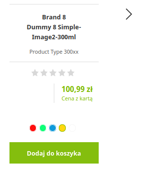

# Drogerie Natura - środowisko lokalne

## Desktop

### registration

-  Brak mozliwosci rejestracji/logowania
-  Podczas rejestracji tabulator oddzialowuje tylko na pola input, brak zachowania dla checkboxow ze zgodami
   
    

### brands

-  Wybrana zakladka A-Z listujaca wszystkie marku, powinna byc koloru zielonego wedlug wizualizacji na figmie
   
    
-  (wszystkie marki) Brak polecanych produktow dla Ciebie dla niezalogowanego klienta

### produkt

-  Scroll nastepuje do sekcji tekstu, naglowek (Opis produktu, oraz pozostale dwie opcje) jest niewidoczny
-  Sekcje: opis produktu oraz skladniki maja rozne style tekstu
-  strona produktów poniżej breakpointu md, flex dalej formatuje divy w rzędzie
  
   

- po przeładowaniu strony poniżej breakpointa md na desktopie filtry pojawiają się w stylu mobile, ale po rozszerzeniu strony nie ma ich wcale + nachodzące na siebie product-tilesy, zerknij na przycisk dodaj do koszyka, na mobile

   

### promocje z gazetki

-  Przekierowania na adresy typu: http://dn20beta.drogerienatura.pl/

### "Alez okazja"

-  Pozostalo 5 produktow, moge dodac do koszyka wiecej niz 5 po promocyjnej cenie
   
    
### Bestsellery

-  Button nachodzi na header nastepnej sekcji
   
    

### newsletter

-  Brak mozliwosci rejestracji niezalogowanego uzytkownika na Newsletter.
-  'X' ktorym mozemy czyscic date dla niektorych rozdzielczosci jest uciety
   
    
   
-  Trzeba dwukrotnie klinac aby mozna bylo wybrac date (za pierwszym razem wczytuje sie formatter)
   
    
   
-  Po wypelnieniu pola z mailem, otwiera sie popup, jesli  go odklikniemy, to znika wpisany mail, a pole podswietla sie na czerwono

   
### product tile

-  Kolor bialy nie jest widoczny, o ile przy produkcie mamy nazwe kolor bialy, to przy karuzelach z produktami juz nie widac ze mamy mozliwosc wyboru bialego koloru

    
### 404 page
-  Zawiera mozliwosc przegladania produktow, na makiecie nie ma takiej mozliwosci
   
    
-  Skontaktuj sie z nami (404) - rowniez adres do dn20beta

### 500 page

-  Brak wycentrowanego tekstu
-  Nieodpowiednie style czcionki (kolor)

### wyszukiwarka produktow

-  Po wpisaniu losowego ciagu znakow i klikniecie Entera pokazuje ;Prosze czekac, trwa wyszukiwanie produktow...' bez konca!

### URL

-  brak uzupelnionych linkow (chociazby kierujacych na pre) m.i. w stopce
-  ręcznie wpisany url marki, która nie istnieje w wyszukiwarce produktów to pojawi się tytuł na stronie

## Mobile

### powiadomienia z panelu logowania/rejestracji/przypomnienia hasla

-  Sa "pod spodem" modala
   
   

### minicart z czerwonym powiadomieniem u gory

-  Sticky header utrudnia zarzadzanie pierwszym produktem

## Fixed:
### polityka prywatnosci
-  Error podczas ladowania CMS page

### error on pages:
-  /klub-natura
   
   
-  /koszty-i-czas-dostawy

   
